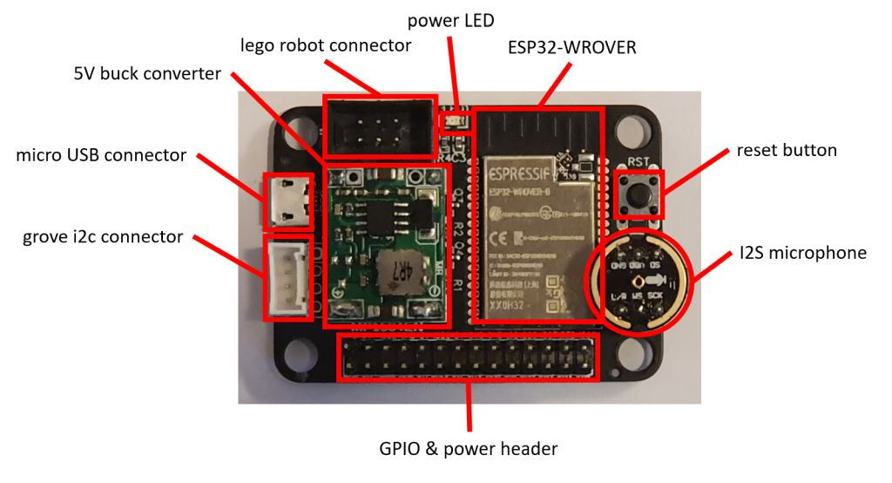
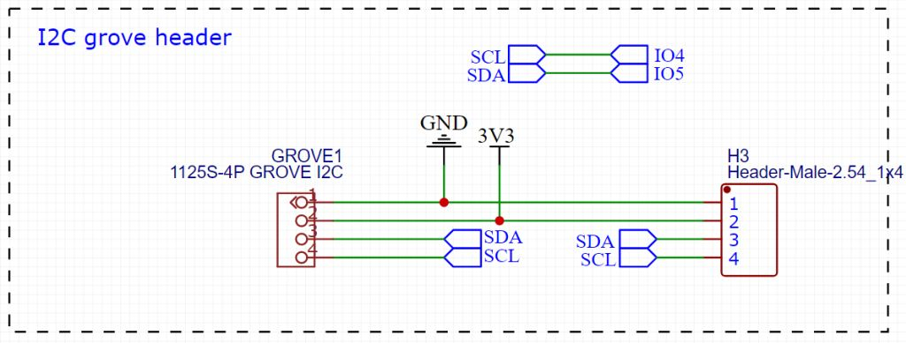
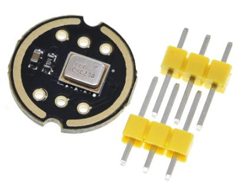
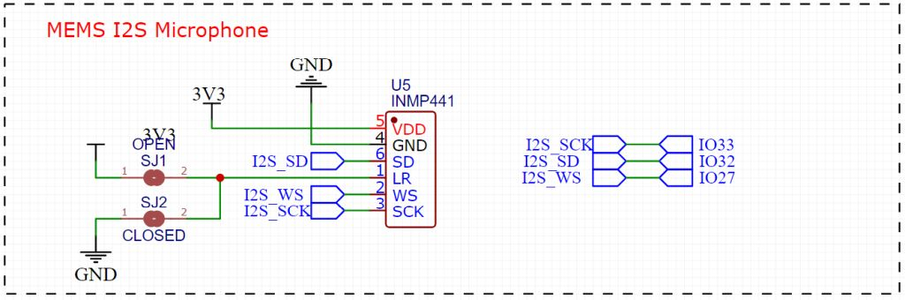
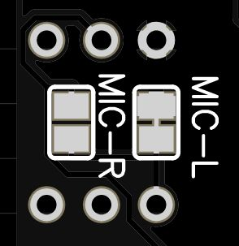
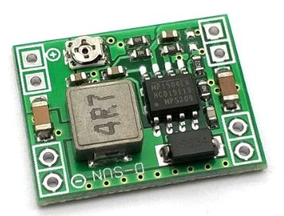

.. currentmodule:: hardware
.. _hardware:

Hardware
========

Overview
--------

In the picture below an overviwe of the hardware components of the LMS-ESP32 board is given.

In the photo shown above, the major components and headers are shown. Below we briefly discuss each of these:

* ESP32-WROVER

  This is the microcontroller we use on the board. It is an Esspressif dual core MCU whith the following specifications.
  - dual 240MHZ core
  - 520kB SRAM
  - 4MByte flash memory
  - 4Mbyte PS-RAM
* power LED

  This LED is connected to the 3.3V power ad will light up when the board is powered.
* micro USB connector

  Used for connecting the board through the build-in usb-uart convertor and for powering the board with 5V
* GPIO power header

  This is the header where you connect your hardware such as servo motors , displays and sensors. There are 5V and 3.3V power pins present on the header

* Groves I2C header

  This is a grove's connector that can be used to connect I2C devices to the board. The connector uses 3.3V power supply.

* I2S microphone
  
  We provide two 3-pin headers for connecting an `INMP441 MEMS microphone`.

  .. note::
    
     The Microphone is connected using the GPIO pins 27,32 and 33. These Pins are also present on the GPIO header. 

* Lego robot connector
  This connector is used to connect the board to your Lego robot. It connects to the 3.3V power, the UART pins and the M+ pin of the robot.
* Reset button
  This button is connected to the reset signal of the ESP32

.. note::

    The pinout and maping on ESP32 GPIO pins can be found in the :ref:`Pinout <pinout>`.

USB connector
-------------

We provide a micro USB connector for  powering the board and for communicating with UART0 of the ESP32 using a CH340 Uart USB transceiver. The additional circuit with the two transistors Q3 and Q4 allows the programming tool to switch the ESP32 in program mode using the EN and IO0 pins.

.. image:: ./images/schematic_lmsesp32_usb.jpg
  :width: 1000
  :alt: USB Schematic

Power supply of the board
-------------------------

When connected to the Lego robot, the board is powered from the robot's 3.3V power supply. When the board is connected to the USB port of a PC, it will get 5V power from the USB port. The 5V is fed to an LMS1117 power regulator with a 3.3V output used for powering the ESP32.

When the robot and the USB port are both connected simultaneously, the 3.3V rail will get its power from both the Lego robot as well as from the output of the LMS1117. Because there is only a small difference in these two voltages, there will be no harm done to the board or the lego robot.

.. image:: ./images/schematic_lmsesp32_power.jpg
  :width: 1000
  :alt: Hardware Overview

For applications that need 5V, such as LED strips or servo motors, we provide 5V outputs on the 14x2 header. This 5V is drawn from hte USB connector when that is connected. For obtaining a stable 5V when the board is only connected to the lego robot, we provide a buck converter that can be added on the board. This buck converts the voltage supplied from the lego robot motor output (which is 8V when the motor power is set to 100%) to 5V in a very efficient way. When powering the board from the robot motor output simultaneously with the USB power, we get two 5V sources: one from the USB connector and one from the output of the buck converter. We estimate the because the voltages are almost the same, no harm willl be done to the board, the lego robot or the USB port.

GPIO header
-----------

The GPIO header provides access to 14 GPIO pins of the ESP32 and provides a number of 5V and 3.3V power pins.

.. image:: ./images/schematic_lmsesp32_gpio_2x14.jpg
  :width: 1000
  :alt: GPIO header

Whe grouped the pins in 3 different regions. The yellow region for connecting servo's or LED strips pwered with 5V (keep in mind that all the logic pins of the ESP32 are only 3.3V tollerant), the red region for power connections and the green region for access to the GPIO pins.

.. note::

  The GPIO Pins are directly connected to the ESP32 and are not 5V tollerant, so use only 3.3V logic signals.

I2C Grove connector
-------------------

We use the standard Grove connector that is used on many i2c sensors. M5Stack Units use them and can directly be connected to the board. Note that the power supply on this port is 3.3V.

I2S Microphone
--------------

We provide two headers for connecting an INMP441 I2S microphone to the board. The esp-idf (Espressif IoT Development Framework) supports natevely the usage of I2S audio devices.

The I2S connections use GPIO 27, 32 and 33 for word clock line (I2S_WS), the data line (I2S_SD) and the bit clock line (I2S_SCK). Note that this microphone is a PCM version.

The solder pads on the back of the board can be used to select in which channel the digital output of the microphone is collected. By default the pad for selecting the left channel is shorted. Should you need to change the channel, than the trace between the MIC-L pads should be removed and the pads MIC-R should be shorted. Take care not to short both pads at the same time, as that leads to a power shortage.

Buck converter
--------------

We provide solder pads for a MP1584 buck converter. The buck converters input is connected to the M+ pin of the Lego robot’s motor interface. When seeting the Lego motor to 100% power, the M+ pin will provide 8V DC. The buck converter brings this voltage down to a well regulated 5V DC.

The following code can be executed on the SPIKE Prime or Robot Inventor hub. Here we use Port A to connect the LMS-ESP32::

  import hub
  # set motor power to +100%, resulting in 8V on M+ and 0V on M-
  hub.port.A.pwm(100)